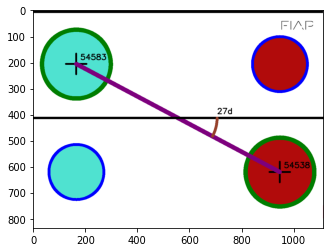

# Template para desenvolvimento e entrega de NAC

Esse é um guia simples, o grupo pode e deve modificar o template conforme necessidade. 

# Nome do projeto

**nome dos alunos:** 
* Gabriel Henrique Pereira Soares 	- RM86420
* Antonio Sassine Mendinça			- RM84297

**Turma:**
2TDSF

**Ano:**
2021

## Objetivo / descrição do Projeto

Visão computacional com python e opencv para reconhecimento de círculos numa imagem.

## Diagrama do projeto

## Como usar 

Baixa jupyter
Execute os notebooks R1.ipynb e R2.ipynb
Execute o python script R3.py

## Link de vídeo demonstração

Adicione o link para assistir ao vídeo do projeto funcionando.

[Link para o video youtube](https://youtu.be/zAcGCDvA5fA)

